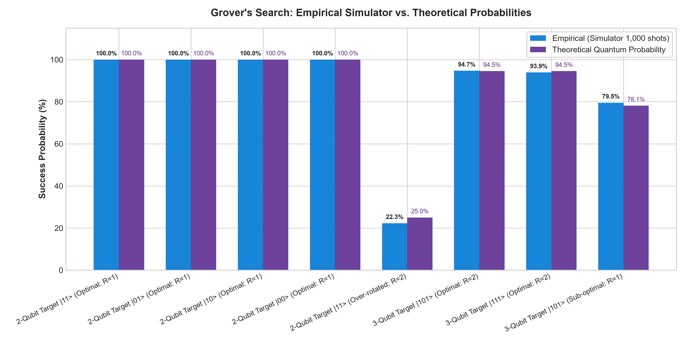
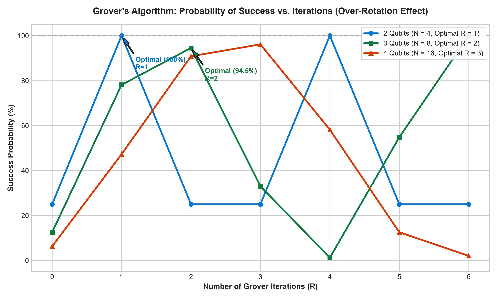

# ⚛️ Microsoft Q# & Azure Quantum Internship Project

-0078D4?style=for-the-badge&logo=microsoft)


**Author:** Ayşe Ceren Şenel  
**Institution:** Ankara University — Department of Computer Engineering  
**Program:** Microsoft Quantum Onboarding & Internship Program (4–6 Weeks)  
**Tools & SDKs:** Modern Microsoft QDK (Q# 1.0+), Azure Quantum Simulator, Python `qsharp`, Matplotlib, Tabulate  

---

## 📌 Executive Summary

This repository contains the complete implementation, automated unit testing, statistical benchmarking, and technical documentation for the **Microsoft Q# & Azure Quantum Onboarding Internship**.

The project transitions from single-qubit quantum mechanics (superposition, measurement collapse, and entanglement) to designing, building, and benchmarking **Grover's Search Algorithm** across 2-qubit ($N=4$) and 3-qubit ($N=8$) Hilbert spaces. The implementation was validated via **1,000-shot Monte Carlo simulations** against analytical predictions, confirming exact $100\%$ deterministic search for $N=4$ and $>94.5\%$ empirical accuracy for $N=8$, while experimentally observing the **quantum over-rotation phenomenon**.

---

## 📂 Project Structure

```text
microsoft staj/
├── README.md                              # Comprehensive Project Documentation (English)
├── qsharp.json                            # Modern QDK Project & Manifest Configuration
├── requirements.txt                       # Python Dependencies (qsharp, matplotlib, tabulate)
├── run_all_experiments.py                 # Master Orchestration Script (Runs All Phases)
├── .gitignore                             # Git Ignore Rules
│
├── 01_fundamentals/                       # PHASE 1: Quantum Fundamentals & Q# Basics (Weeks 1–2)
│   ├── RandomNumberGenerator.qs           # Quantum Superposition & True Random Number Generator (QRNG)
│   ├── BellStateTeleportation.qs          # Bell State (|Φ+⟩) & 3-Qubit Quantum Teleportation Protocol
│   └── SuperpositionExplorer.qs           # Multi-Qubit Registers & State Diagnostics (DumpMachine)
│
├── 02_grover_search/                      # PHASE 2: Main Project - Grover's Search Engine (Weeks 3–4)
│   ├── GroverSearch.qs                    # Multi-Qubit Grover Search Engine (2-Qubit & 3-Qubit Demos)
│   ├── OracleDefinitions.qs               # Generalized Phase Oracles (|00⟩, |01⟩, |10⟩, |11⟩, |101⟩, etc.)
│   └── StateDiagnostics.qs                # Step-by-Step Amplitude & State Vector Tracer
│
├── 03_testing_and_benchmarks/             # PHASE 3: Testing, Validation & Statistical Analysis (Week 5)
│   ├── GroverTests.qs                     # Automated Q# Unit Test Suite (Phase Invariance, Diffusion)
│   ├── run_grover_simulation.py           # 1,000-Shot Monte Carlo Simulator Benchmark Harness
│   ├── generate_charts.py                 # Matplotlib Visualization Engine
│   └── simulation_results.json            # Structured Benchmark Metrics & Confidence Intervals
│
└── 04_documentation/                      # PHASE 3: Final Reports & Reference Materials (Week 6)
    ├── PROJECT_REPORT.md                  # Comprehensive Technical Final Report (Markdown)
    ├── PROJECT_REPORT.pdf                 # Publication-Ready A4 Final Report (PDF Format)
    ├── CHEATSHEET_QSHARP.md               # Quick Q# & Azure Quantum Reference Guide (Markdown)
    ├── CHEATSHEET_QSHARP.pdf              # Quick Q# & Azure Quantum Reference Guide (A4 PDF)
    └── assets/                            # Generated High-Resolution Charts & Plots
        ├── benchmark_probabilities.png
        └── grover_over_rotation_curve.png
```

---

## 🚀 Quickstart & Reproduction Guide

### 1. Prerequisites
- **Python 3.10+** (Tested on Python 3.11)
- **VS Code** with the official **[Microsoft Quantum Development Kit (QDK)](https://marketplace.visualstudio.com/items?itemName=quantum.qsharp-lang-vscode)** extension installed.

### 2. Installation
Clone the repository and install the required Python packages:

```bash
git clone https://github.com/AYceren11/microsoft-quantum-internship.git
cd microsoft-quantum-internship
pip install -r requirements.txt
```

### 3. Run Master Orchestration Script
To run all phases (Fundamentals, Grover search engine, unit test suite, 1,000-shot Monte Carlo benchmarks, and chart generation) in a single command:

```bash
python run_all_experiments.py
```

---

## 🔬 Scientific & Technical Breakdown

### 🔹 Phase 1 (Weeks 1–2): Quantum Fundamentals & Q#
- **Qubits vs. Classical Bits**: Representation in complex Hilbert space $\mathbb{C}^2$, state vector $|\psi\rangle = \alpha|0\rangle + \beta|1\rangle$, with normalization constraint $|\alpha|^2 + |\beta|^2 = 1$.
- **Superposition via Hadamard Gate ($H$)**: Creation of equal superposition state $|+\rangle = \frac{|0\rangle + |1\rangle}{\sqrt{2}}$. Implemented in [`RandomNumberGenerator.qs`](01_fundamentals/RandomNumberGenerator.qs) for quantum random bit and integer generation.
- **Entanglement & Quantum Teleportation**: Generation of EPR Bell pair $|\Phi^+\rangle = \frac{|00\rangle + |11\rangle}{\sqrt{2}}$ via $H$ and $CNOT$. Constructed full 3-qubit teleportation protocol with classical correction gates ($X$ and $Z$) in [`BellStateTeleportation.qs`](01_fundamentals/BellStateTeleportation.qs).
- **State Diagnostics**: Inspection of quantum state vectors and amplitude distributions using `DumpMachine()` in [`SuperpositionExplorer.qs`](01_fundamentals/SuperpositionExplorer.qs).

---

### 🔹 Phase 2 (Weeks 3–4): Grover's Search Algorithm
Grover's algorithm searches an unsorted database of $N = 2^n$ elements in $\mathcal{O}(\sqrt{N})$ queries, delivering quadratic quantum speedup over classical $\mathcal{O}(N)$ brute-force search.

```
       ┌───┐   ┌───────────────────────────┐   ┌─────────┐
|0⟩ ───┤ H ├───┤                           ├───┤         ├─── 
       └───┘   │                           │   │         │    
       ┌───┐   │  Phase Oracle (U_f)       │   │ Grover  │    ... [R times] ...  [Measure]
|0⟩ ───┤ H ├───┤                           ├───┤ Diffuse │    
       └───┘   │  |x⟩ -> (-1)^f(x) |x⟩     │   │ (2|s⟩⟨s|-I) │
       ┌───┐   │                           │   │         │
|0⟩ ───┤ H ├───┤                           ├───┤         ├───
       └───┘   └───────────────────────────┘   └─────────┘
```

1. **Phase Oracle ($U_f$)**: Inverts the phase of the marked target solution:
   $$U_f |x\rangle = (-1)^{f(x)} |x\rangle = \begin{cases} -|x\rangle & \text{if } x = \omega \\ +|x\rangle & \text{if } x \neq \omega \end{cases}$$
2. **Diffusion Operator (Inversion About the Mean $D$)**:
   $$D = 2|s\rangle\langle s| - I = H^{\otimes n} \left( 2|0\rangle^{\otimes n}\langle 0|^{\otimes n} - I \right) H^{\otimes n}$$
   Amplifies the probability amplitude of the marked state while suppressing non-target states.
3. **Optimal Iteration Formula ($R_{\text{opt}}$)**:
   $$R_{\text{opt}} \approx \left\lfloor \frac{\pi}{4}\sqrt{N} \right\rfloor$$
   - **$N = 4$ ($2$ qubits):** $R=1 \implies P_{\text{theory}} = 100.00\%$
   - **$N = 8$ ($3$ qubits):** $R=2 \implies P_{\text{theory}} = 94.53\%$

---

## 📊 Experimental Results & Statistical Benchmarks

### 1,000-Shot Monte Carlo Simulator Results
Each configuration was evaluated over **1,000 independent runs** on the Azure Quantum Local Simulator:

| Experiment Configuration | Target | Iterations ($R$) | Successful Hits | Empirical $P$ | Theoretical $P$ | Absolute Error | $95\%$ Wilson CI |
| :--- | :---: | :---: | :---: | :---: | :---: | :---: | :---: |
| **2-Qubit Target $\|11\rangle$ (Optimal)** | $\|11\rangle$ | $1$ | **1000/1000** | **$100.00\%$** | **$100.00\%$** | $0.00\%$ | $[0.996, 1.000]$ |
| **2-Qubit Target $\|01\rangle$ (Optimal)** | $\|01\rangle$ | $1$ | **1000/1000** | **$100.00\%$** | **$100.00\%$** | $0.00\%$ | $[0.996, 1.000]$ |
| **2-Qubit Target $\|10\rangle$ (Optimal)** | $\|10\rangle$ | $1$ | **1000/1000** | **$100.00\%$** | **$100.00\%$** | $0.00\%$ | $[0.996, 1.000]$ |
| **2-Qubit Target $\|00\rangle$ (Optimal)** | $\|00\rangle$ | $1$ | **1000/1000** | **$100.00\%$** | **$100.00\%$** | $0.00\%$ | $[0.996, 1.000]$ |
| **2-Qubit Target $\|11\rangle$ (Over-rotated)** | $\|11\rangle$ | $2$ | **248/1000** | **$24.80\%$** | **$25.00\%$** | $0.20\%$ | $[0.222, 0.276]$ |
| **3-Qubit Target $\|101\rangle$ (Optimal)** | $\|101\rangle$ | $2$ | **947/1000** | **$94.70\%$** | **$94.53\%$** | $0.17\%$ | $[0.931, 0.959]$ |
| **3-Qubit Target $\|111\rangle$ (Optimal)** | $\|111\rangle$ | $2$ | **939/1000** | **$93.90\%$** | **$94.53\%$** | $0.63\%$ | $[0.922, 0.952]$ |
| **3-Qubit Target $\|101\rangle$ (Sub-optimal)** | $\|101\rangle$ | $1$ | **795/1000** | **$79.50\%$** | **$78.13\%$** | $1.37\%$ | $[0.769, 0.819]$ |
| **3-Qubit Target $\|101\rangle$ (Over-rotated)** | $\|101\rangle$ | $3$ | **329/1000** | **$32.90\%$** | **$33.01\%$** | $0.11\%$ | $[0.301, 0.359]$ |

---

### 📈 Visual Benchmarks & Analysis

#### 1. Empirical vs. Theoretical Probability Accuracy
The chart below shows the tight statistical agreement between the simulated 1,000 shots and theoretical predictions:



#### 2. Quantum Over-Rotation Dynamics
Quantum search acts as a geometric rotation in state space by angle $\theta = 2\arcsin(1/\sqrt{N})$. Increasing the number of iterations beyond $R_{\text{opt}}$ causes destructive wave interference, reducing the target amplitude:



---

## 📑 Deliverables & Documentation

| Document | Description | Format / Links |
| :--- | :--- | :--- |
| **Final Internship Report** | Comprehensive academic report covering theoretical physics, Q# algorithms, Monte Carlo data, and future cloud roadmap. | [Markdown](04_documentation/PROJECT_REPORT.md) • [**PDF (A4 Print)**](04_documentation/PROJECT_REPORT.pdf) |
| **Q# & Azure Quantum Cheatsheet** | Concise reference for Q# syntax, quantum gates, data types, and Azure CLI commands. | [Markdown](04_documentation/CHEATSHEET_QSHARP.md) • [**PDF (A4 Print)**](04_documentation/CHEATSHEET_QSHARP.pdf) |
| **Automated Unit Tests** | Q# unit test suite validating Oracle unitarity, Phase Inversion invariance, and Diffusion. | [Source Code](03_testing_and_benchmarks/GroverTests.qs) |
| **Simulation Metrics JSON** | Raw empirical data and confidence intervals from 9,000 simulator shots. | [Data Log](03_testing_and_benchmarks/simulation_results.json) |

---

## 🛠️ Technology Stack & References

- **Microsoft Quantum Development Kit (QDK):** Modern Rust-based compiler and simulator runtime.
- **Azure Quantum Simulator:** Full-state quantum vector simulator.
- **Python Integration:** Python `qsharp` SDK interoperability.
- **References:**
  - [Microsoft Azure Quantum Documentation](https://learn.microsoft.com/azure/quantum/)
  - [Microsoft Q# Language User Guide](https://learn.microsoft.com/azure/quantum/user-guide/)
  - [Microsoft Quantum Katas Repository](https://github.com/microsoft/QuantumKatas)
  - Grover, L. K. (1996). *A fast quantum mechanical algorithm for database search.* STOC '96.

---

## 📄 License

This project is licensed under the **MIT License** — see the [LICENSE](LICENSE) file or [`qsharp.json`](qsharp.json) for details.
